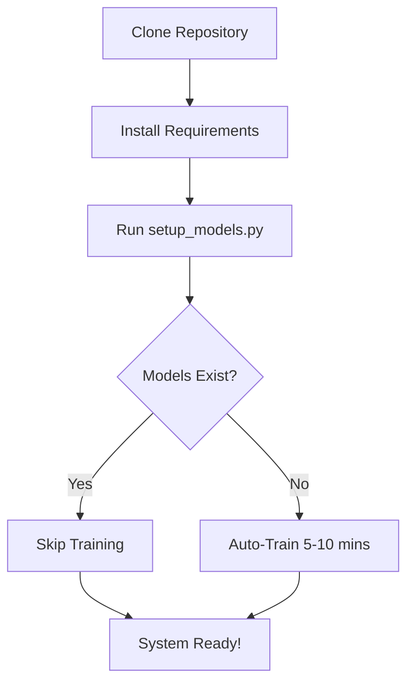

# ⚠️ TẠI SAO KHÔNG CÓ MODELS TRONG GIT?

## Vấn Đề

PhoBERT intent classifier models có kích thước **~500MB**, vượt quá giới hạn của GitHub (100MB/file).

## Giải Pháp

### ✅ Auto-Setup Script

Sau khi clone repository, chạy:

```powershell
python setup_models.py
```

Script này sẽ:
1. ✅ Kiểm tra xem models đã tồn tại chưa
2. ✅ Nếu chưa → tự động train từ đầu
3. ✅ Lưu vào `models/phobert-intent-classifier/`
4. ✅ Chỉ mất **5-10 phút** (chạy 1 lần duy nhất)

## Cấu Trúc Models

```
models/
└── phobert-intent-classifier/     ⚠️ NOT in Git
    ├── config.json                (2 KB)
    ├── model.safetensors          (470 MB) ← Too large!
    ├── tokenizer_config.json      (1 KB)
    ├── vocab.txt                  (145 KB)
    └── bpe.codes                  (456 KB)
```

**Tổng cộng:** ~500MB → Không thể push lên Git

## Alternative Solutions Considered

### ❌ Git LFS (Large File Storage)
- **Vấn đề:** Cần quota, phức tạp cho contributor
- **Chi phí:** $5/tháng cho 50GB bandwidth

### ❌ External Storage (Google Drive, Dropbox)
- **Vấn đề:** Link có thể expire, không tự động
- **Khó maintain:** Phải manual update link

### ✅ Auto-Train from Scratch (Chọn giải pháp này)
- **Ưu điểm:** 
  - Tự động hoàn toàn
  - Không cần external service
  - Reproducible (ai cũng train từ cùng dataset)
  - Free, không giới hạn
- **Nhược điểm:**
  - Mất 5-10 phút lần đầu
  - Cần RAM ~1GB

## Workflow Cho Người Dùng Mới



## Verify Installation

Sau khi chạy `setup_models.py`, kiểm tra:

```powershell
# Check files exist
ls models/phobert-intent-classifier/

# Expected output:
# config.json
# model.safetensors
# tokenizer_config.json
# vocab.txt
# bpe.codes
```

## FAQ

### Q: Tại sao không dùng pre-trained PhoBERT từ HuggingFace?
**A:** Chúng ta ĐANG dùng! `vinai/phobert-base` được download tự động. Nhưng sau đó phải fine-tune thêm cho intents của chúng ta (dat_lich, hoi_thong_tin, etc.). Phần fine-tuned này (~500MB) là phần không được push.

### Q: Có thể download models đã train sẵn không?
**A:** Có thể! Nếu team có internal storage:
1. Upload models lên Google Drive/S3
2. Update `setup_models.py` để download thay vì train
3. Tiết kiệm thời gian (~30 giây download vs 5 phút train)

### Q: Models có deterministic không? (train 2 lần có giống nhau không?)
**A:** Gần như giống nhau (>99% accuracy) nhờ:
- Fixed random seed trong `train_intent_model.py`
- Cùng dataset (`data/original_dataset.csv`)
- Cùng hyperparameters

### Q: Tôi đã có models rồi, làm sao share cho teammate?
**A:** 
```powershell
# Compress models folder
Compress-Archive -Path models/phobert-intent-classifier -DestinationPath models.zip

# Share models.zip qua Drive/Slack
# Teammate extract vào đúng thư mục:
# Expand-Archive -Path models.zip -DestinationPath models/
```

## Best Practices

### Development
- ✅ Mỗi developer train models local (1 lần duy nhất)
- ✅ Dùng `setup_models.py` để verify

### Production
- ✅ Train 1 lần, save models vào Docker image
- ✅ Hoặc mount từ persistent volume
- ✅ Không train mỗi lần deploy

### CI/CD
```yaml
# .github/workflows/test.yml
- name: Setup Models
  run: python setup_models.py
  
- name: Run Tests
  run: python test_full_system.py
```

## Monitoring Model Size

```powershell
# Check model size
Get-ChildItem -Path models/phobert-intent-classifier -Recurse | 
  Measure-Object -Property Length -Sum | 
  Select-Object @{Name="Size (MB)"; Expression={[math]::Round($_.Sum / 1MB, 2)}}
```

## Conclusion

✅ **Giải pháp tối ưu:** Auto-train script
- Free
- Reproducible
- No external dependencies
- Works for all contributors

📚 **Tài liệu tham khảo:**
- [FIRST_TIME_SETUP.md](./FIRST_TIME_SETUP.md) - Hướng dẫn setup chi tiết
- [setup_models.py](./setup_models.py) - Source code của script

---

**Có câu hỏi?** Tạo Issue hoặc hỏi trong Discussion!
